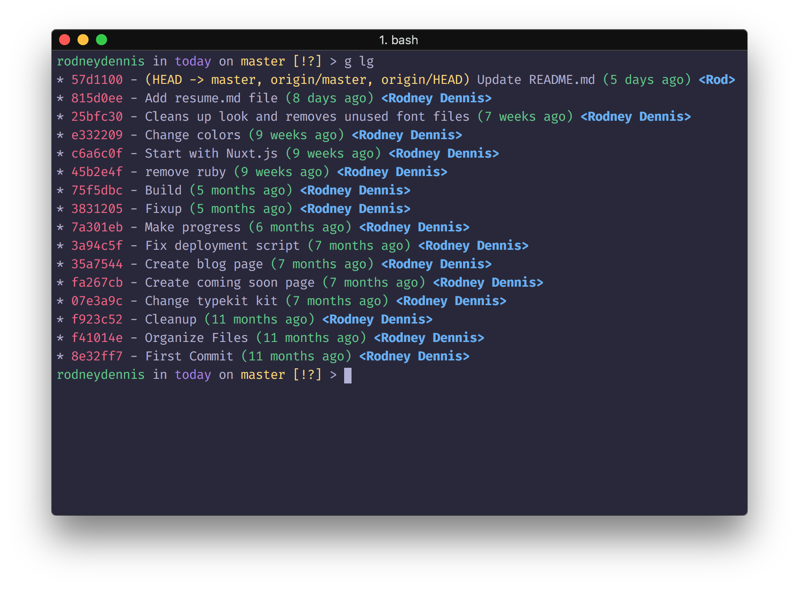

# whimsy-iterm2

> A waggish theme for [iTerm2](https://www.iterm2.com)

## Install
1. Download [Whimsy.itermcolors](Whimsy.itermcolors)
2. Double-click downloaded file

## License
MIT @ [Rodney Dennis](https://rod.today)